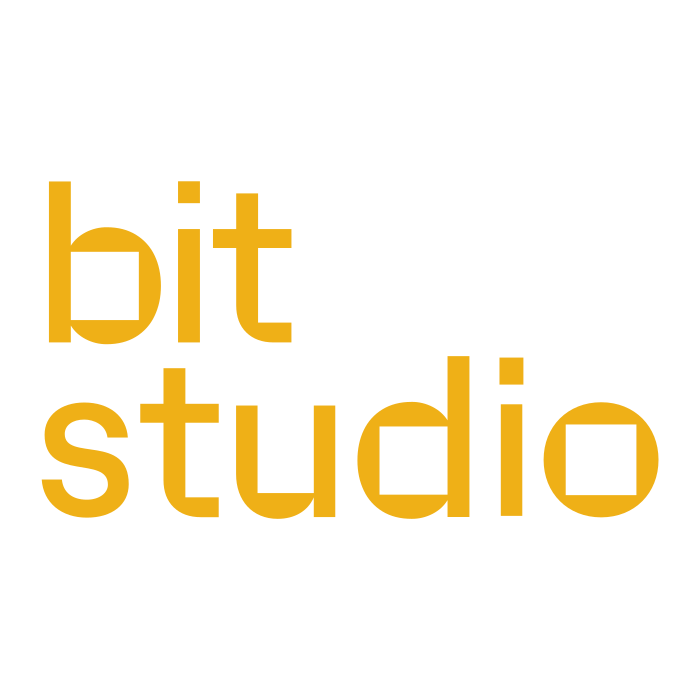

<div align="center">

  

  <h1>Bit Agents</h1>

  <p><b>One set of agent instructions and one coding-standards gate, shared by every coding agent.</b></p>

  <a href="https://wearebit.com/"></a>
  &nbsp;
  <a href="https://agentskills.io"></a>
  &nbsp;
  

  <a href="https://github.com/astral-sh/ruff"></a>
  &nbsp;
  <a href="https://pre-commit.com"></a>
</div>

## Overview

An **agent-agnostic** starter repo. It ships one canonical set of agent
instructions + a self-contained coding-standards gate, so Claude, Codex, Gemini,
and Copilot all follow the same rules with no per-tool restating.

## Start a new project from this skeleton

Bitbucket has no one-click "template" button (that's a GitHub feature), so copy
from this skeleton:

```bash
git clone <this-skeleton-url> my-new-project
cd my-new-project
rm -rf .git && git init            # detach from the skeleton's history
```

Use `git clone` (not `cp -r`) so the symlinks are preserved as symlinks. On
Windows, enable `git config --global core.symlinks true`.

## Then, once per new project

1. **Rename the project skill:** `.agents/skills/project-guide/` → something
   specific (e.g. `myapp-maintainer`), update its `name:` frontmatter, and fill
   in the TODOs. Keep it updated as the project evolves — it's the repo's memory
   for every agent.
2. **Wire the linter deps:** merge `requirements-dev.txt` (`ruff`, `pre-commit`)
   into your project's real manifest.
3. **Install the gate:** `pip install pre-commit && pre-commit install`.
4. **Adjust exceptions:** add this repo's vendored/generated dirs to the
   `extend-exclude` in `ruff.toml` and the `exclude:` regex in
   `.pre-commit-config.yaml`. Grandfather any existing backlog via
   `[lint.per-file-ignores]` in `ruff.toml` (see the commented example there).

## Layout

```
AGENTS.md                         canonical, repo-agnostic agent entrypoint
CLAUDE.md            -> AGENTS.md  (symlink)
.gemini/settings.json             points Gemini CLI at AGENTS.md

.agents/skills/                   source of truth for skills (Agent Skills spec)
  bit-story-workflow/             governing story -> plan -> build -> commit flow
  project-guide/                  governing skill for THIS repo (placeholder)
  coding-standards/               house style (guidance only)
  linting/                        how the mechanical checks are automated
  prompting/                      prompt-writing guidance per vendor and model
.claude/skills       -> ../.agents/skills  (symlink, so Claude discovers them)

linting/                          the machinery (kept out of the skills)
  ruff.toml  check.py  standards_checks/  eslint.config.mjs  .pre-commit-config.yaml

ruff.toml                         extends linting/ruff.toml + repo exceptions
figures/                          README assets
```

**Why it's agent-agnostic:** enforcement (pre-commit → ruff +50/250 line
checks) runs at the git layer, so it holds regardless of which agent commits;
guidance is one canonical `AGENTS.md` + symlinks, so each tool reads it via its
native entrypoint without restating anything.

## About Us

[Bit](https://wearebit.com/) is a B-Corp Certified research and prototyping studio based in Amsterdam with a team of 65 ambitious talents. We’re on a mission to fast-forward innovation and turn emerging technologies into real-world impact. The world is changing fast and the old ways of working can’t keep up. That’s why we help organisations stay ahead by building practical, future-ready solutions. No endless strategy slides. Just sharp minds, fast execution and a shared belief in building what’s next, together.
